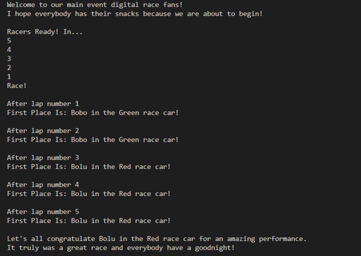

# Race Simulator in C

## Description
I built this simple application to test my knowledge of structures and pointers in C.

The details of the code are attached as comments.

## How to use
1. Get a C Compiler, in my case I am using gcc compiler and running it through visual studio. So the first step is to open your VS Code software.
2. Open a terminal where you will be able to change directory, compile the c code and then execute the application.
3. Change directory to the location of the Race_Simulator.c file. This might not be neccessary if your terminal is already in the directory. If not use the **`cd`** command to change directory
4. Compile the c code by typing the **`gcc`** command below into the VS Code's terminal. An example could be 

`gcc Race_Simulator.c -o racer.exe`

5. Finally, execute the application file. In my case I typed the code below into my VS Code's terminal
`.\racer.exe`

## Result
In the end, you should get something similar to the image shown below but not in the exact format since the result is influenced by the random numbers used to generate the total lap time for each race car.

